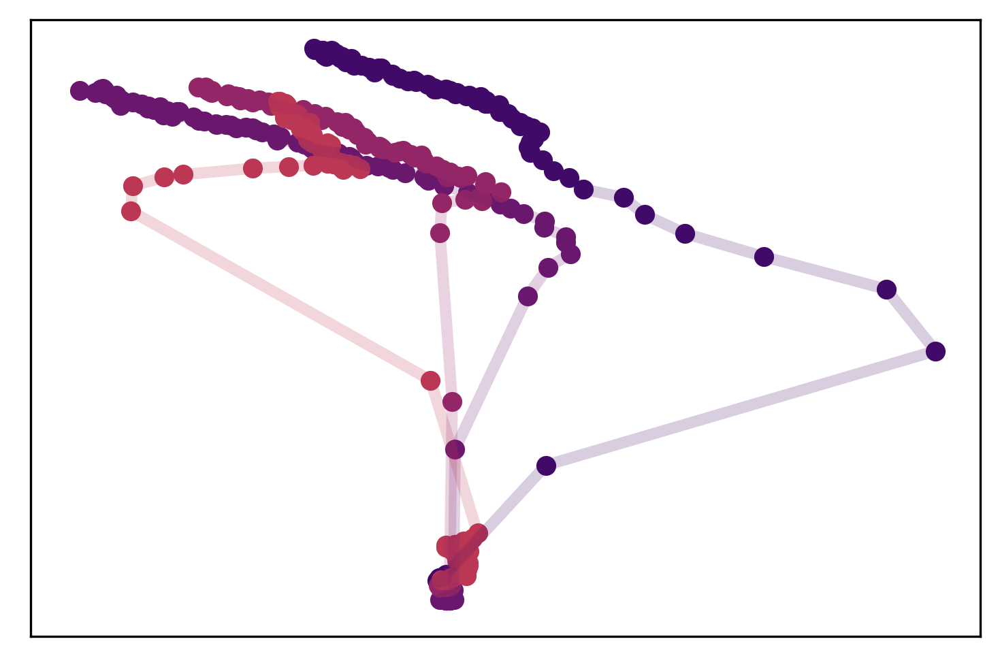

<div align="center">
    <h1> deep-ei </h1>
  
</div>
<div align="center">
    <a href="https://badge.fury.io/py/deep-ei"></a>
    <a href='https://deep-ei.readthedocs.io/en/latest/?badge=latest'></a>
    <a href="https://travis-ci.com/EI-research-group/deep-ei"></a>
    <a href="https://neuralnet.science"></a>
    <!--  -->
    <p>This code accompanies the paper <b>"Examining the Causal Structures of Artificial Neural Networks Using Information Theory"</b> by Simon Mattsson, <a href="https://ericjmichaud.com">Eric J. Michaud</a>, and <a href="https://www.erikphoel.com/">Erik Hoel</a></p>
</div>

## What's here?
This repository contains all the code used in the paper (notebooks for creating figures, experiment scripts, etc) in the `experiments` directory, but most importantly holds the open-source `deep-ei` module. We encourage people to install `deep-ei` and perform their own experiments on new datasets, neural network architectures, etc. There are so many experiments we'd like to do, but haven't had time to yet! If you'd like to contribute to code, just submit a pull request! (note that all the code is currently structured as a single module, but may eventually be restructured as a package if that makes sense). 


## Installation:

The simplest way to install the `deep_ei` module is with:
```
pip install deep-ei
```
Becaues `pytorch` can be fragile, it is recommended that you install and test `pytorch` before installing `deep-ei` (such as with `conda install pytorch -c pytorch`). To install `deep-ei` directly from this repository:
```
git clone https://github.com/EI-research-group/deep-ei.git
cd deep-ei
pip install .
```
Basic tests can be executed with:
```
python setup.py test
```
Note that we have also provided an anaconda environment file. You can use it to create a new environment with `deep-ei` and all its dependencies:
```
conda env create --file environment.yml
```

## Experiments
Code from the paper has been grouped into two directories:
```
experiments/
├── notebooks
└── runs
```
Where `notebooks` contains notebooks for making the figures and `runs` contains the code and resulting data from the experiments. **Note that all these files use a version of deep-ei before 0.7.0. So to run any of them yourself, install version 0.6.4 from commit 7d37642649594d14bc02590dc4edb5a1f858f501**. Note also that you will have to change the path to the experiment data in many of these notebooks.


## Using `deep-ei`
Detailed documentation can be found at [readthedocs.io](https://deep-ei.readthedocs.io/en/latest), but here are some basic examples:

```python
import torch
import torch.nn as nn

from deep_ei import topology_of, ei, ei_parts, sensitivity

device = torch.device('cuda' if torch.cuda.is_available() else 'cpu')
dtype = torch.float32
torch.set_default_dtype(dtype)

network = nn.Linear(5, 5, bias=False).to(device)
top = topology_of(network, input=torch.zeros((1, 5)).to(device))

EI = ei(network, top,
                samples=int(1e5),
                batch_size=100, 
                in_range=(0, 1),
                in_bins=8,
                out_range=(0, 1),
                out_bins=8,
                activation=nn.Sigmoid(), 
                device=device)
```
This will compute the EI of the ``5 -> 5`` dense layer ``network`` using a sigmoid activation and 100000 samples. 

The function ``topology_of`` creates a ``networkx`` graph representing the connectivity of the network. ``ei`` can infer argument values using this graph, such as the ranges of the inputs and outputs of the layer and its activation function:
```python
network = nn.Sequential(
    nn.Linear(20, 10, bias=False),
    nn.Sigmoid(),
    nn.Linear(10, 5, bias=False),
    nn.Tanh()
)
top = topology_of(network, input=torch.zeros((1, 20)).to(device))

layer1, _, layer2, _ = network

EI_layer1 = ei(layer1, top,
                    samples=int(1e5),
                    batch_size=100, 
                    in_range=(0, 1),
                    in_bins=8,
                    out_bins=8, 
                    device=device)

EI_layer2 = ei(layer2, top,
                    samples=int(1e5),
                    batch_size=100, 
                    in_bins=8,
                    out_bins=8, 
                    device=device)
```
Which will use an activation of `nn.Sigmoid` and an `out_range` of `(0, 1)` for the first layer and an activation of `nn.Tanh` and an `out_range` of `(-1, 1)` for the second layer. Note that we have to specify an `in_range` for the first layer.

EI_parts can be computed similarly:
```python
device = torch.device('cuda' if torch.cuda.is_available() else 'cpu')
dtype = torch.float32
torch.set_default_dtype(dtype)

network = nn.Linear(5, 5, bias=False).to(device)
top = topology_of(network, input=torch.zeros((1, 5)).to(device))

EI_parts = ei_parts(network, top,
                    samples=int(1e5),
                    batch_size=100, 
                    in_range=(0, 1),
                    in_bins=8,
                    out_range=(0, 1),
                    out_bins=8,
                    activation=nn.Sigmoid(), 
                    device=device)
```

With ``ei_parts``, you can specify a ``threshold`` instead of setting a manual number of ``samples`` (indeed this is the default behavior of ``ei_parts``, with default threshold of 0.05). The function will increase the number of samples it uses until EI_parts levels off (characterized by whether EI_parts will change by less than ``threshold`` of its current value even if we doubled the number of samples):
```python
network = nn.Linear(10, 10, bias=False).to(device)
top = topology_of(network, input=torch.zeros((1, 10)).to(device))

EI = ei_parts(network, top,
                    threshold=0.05,
                    batch_size=100, 
                    in_range=(0, 1),
                    in_bins=64,
                    out_range=(0, 1),
                    out_bins=64,
                    activation=nn.Sigmoid(), 
                    device=device)
```


You can also measure the sensitivity of a layer like so:
```python
network = nn.Linear(10, 10, bias=False).to(device)
top = topology_of(network, input=torch.zeros((1, 10)).to(device))

sensitivity = sensitivity(network, top,
                            samples=1000,
                            batch_size=100, 
                            in_range=(0, 1),
                            in_bins=64,
                            out_range=(0, 1),
                            out_bins=64,
                            activation=nn.Sigmoid(), 
                            device=device)
```

If you want to compute the EI of each edge in a layer (giving you each term that is summed to get EI_parts), use the `ei_parts_matrix` function:
```python
network = nn.Linear(20, 10, bias=False).to(device)
top = topology_of(network, input=torch.zeros((1, 20)).to(device))

EI = ei_parts_matrix(network, top,
                    samles=50000,
                    batch_size=100, 
                    in_range=(0, 1),
                    in_bins=64,
                    out_range=(0, 1),
                    out_bins=64,
                    activation=nn.Sigmoid(), 
                    device=device)
```
Which will return a `20 x 10` matrix where the rows correspond with in-neurons and the columns correspond with out-neurons. 

## Ideas for future experiments
We'd love for people to use and expand on this code to make new discoveries. Here are some questions we haven't looked into yet:
* How does dropout effect the EI of a layer? In otherwise identical networks, does dropout increase or decrease the EI of the network layers?
* What can EI tell us about generalization? Does EI evolve in the causal plane in different ways when a network is memorizing a dataset vs generalizing? To test this, train networks on some dataset as you would normally, but then randomize the labels in the training dataset and train new networks. This label randomization will force the network to memorize the dataset.
* On harder tasks, where deep networks are required (in MNIST and Iris, which we studied, it is unnecessary that networks be deep for them to achieve good acuracy), do the hidden layers differentiate in the causal plane?
* Can EI be measured in recurrent networks? How would this work?

## Contributing & Questions:
We'd welcome feedback and contributions! Feel free to email me at `eric.michaud99@gmail.com` if you have questions about the code. 


